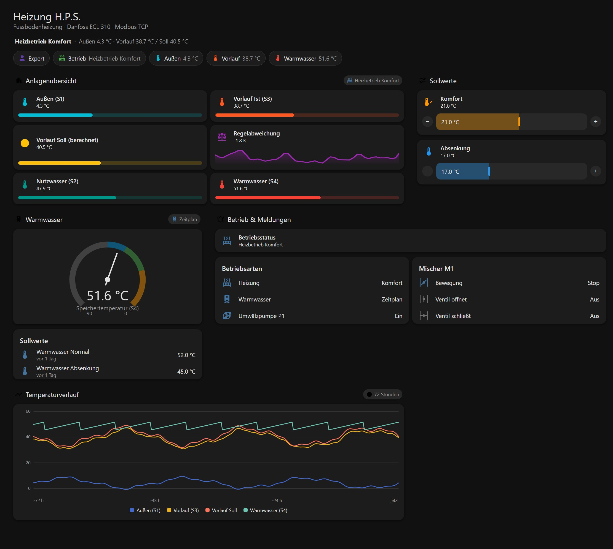
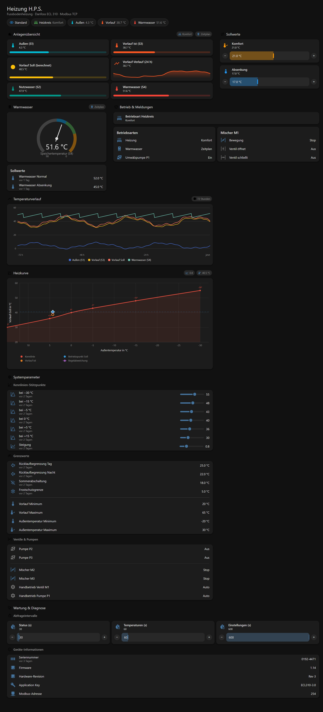

# Danfoss ECL310 for Home Assistant

[](https://github.com/hacs/integration)
[](https://github.com/acdcnow)
[]()


This is a custom integration for **Home Assistant** to monitor and control **Danfoss ECL310** district heating controllers via **Modbus TCP**.
Using Application 247.1 (V01)

It supports reading temperatures, pump/valve statuses, and operating modes, as well as writing target temperatures and the heat curve back to the controller.

## ⚠️ Requirements

* Home Assistant **2026.9** or newer.
* The built-in **Modbus** integration (installed automatically as a dependency). It does not need any YAML configuration of its own.

The controller is always addressed on Modbus unit **254**, which is fixed by Danfoss for application 247.1 and therefore is not asked for during setup.

## 🚀 Version 1.2.0

1.2.0 replaces the integration's own Modbus socket with Home Assistant's built-in **Modbus**
integration. That is what makes it work on 2026.9+, lets other Modbus clients share the
controller, and removes the pymodbus version juggling of 1.1.x. The full list is in
[CHANGELOG.md](CHANGELOG.md) and in the [release notes](https://github.com/acdcnow/Danfoss-ECL-310-for-Home-Assistant/releases/tag/v1.2.0).

> **⚠️ Home Assistant 2026.9 or newer is required.** On an older Home Assistant the integration will not load at all.

**What changed since 1.1.9**

| | |
| --- | --- |
| **Shared connection** | The controller is read through the Modbus integration (`async_get_unit`), so a second Modbus client on the same controller no longer competes for the one available session. |
| **Five devices** | Entities are grouped onto **Controls**, **Sensors**, **Pumps**, **Configuration** and **Diagnostics** ([see below](#-devices)) instead of piling up on one page. |
| **Batched polling** | Neighbouring registers are read as one Modbus block per group; the three intervals (status 30 s, temperature 60 s, settings 600 s) are adjustable at runtime. |
| **Identity on the device page** | Serial number, firmware and hardware revision now reach the device registry - in 1.1.x the sensors holding them were registered as disabled and never ran. |
| **Honest errors** | A rejected write raises a visible error instead of failing silently, and a controller that stops answering marks its entities unavailable. |
| **Reconfigure** | The IP address can be changed from the integration's ⋮ menu without deleting and re-adding the entry. |
| **Dashboard included** | A ready-to-use Lovelace dashboard ships in [`dashboards/`](dashboards) ([see below](#-dashboard)). |

**Upgrading from 1.1.x is safe.** Entity IDs and unique IDs are stored the first time an entity is
registered, so an existing install keeps exactly the IDs it has - only the device page an entity is
filed under changes. Rolling back is equally safe: redownload **1.1.9** in HACS (or put the previous
folder back) and restart Home Assistant.

### What is worth checking

* The entities are now grouped onto several devices — **Controls**, **Sensors**, **Pumps**, **Configuration** and **Diagnostics**, all hanging off the controller device. Check that each one lands where you would expect.
* The controller's device page now shows a **serial number, firmware and hardware revision**. These never appeared in 1.1.9, because the sensors that held them were registered as disabled and so never ran.
* **Temperatures, pump and valve states** read the same as before, but they are now explicitly requested from unit 254 rather than relying on a Modbus keyword that recent versions of the underlying library had removed.
* Changing **Set: Target Comfort** / **Set: Target Setback** reaches the controller, and a rejected write now raises a visible error instead of failing silently.
* If you run another Modbus integration against the same controller, both should keep working — they now share a single connection instead of competing for it.
* **Reconfigure** on the integration's ⋮ menu lets you change the controller's IP without deleting and re-adding the entry.

Please report anything that looks wrong on the [issue tracker](https://github.com/acdcnow/Danfoss-ECL-310-for-Home-Assistant/issues), with debug logging enabled (see [Troubleshooting](#-troubleshooting)).

## ✨ Features

* **Shared Modbus connection:** The integration asks Home Assistant's Modbus integration for a unit on your controller instead of opening its own socket, so it never competes with other Modbus integrations for the device.
* **Multi-Device Support:** Add multiple ECL310 controllers by IP address; they will appear as separate devices in Home Assistant.
* **Setpoint Control:** Adjust "Comfort" and "Setback" target temperatures and the heating curve directly from the Lovelace UI. Changes are written back to the controller, and the controller's own response is reported if a write fails.
* **Localized:** Fully translated into **English, German, French, Italian, and Spanish**.
* **Robust Connection:** Dropped links are re-established automatically, and a controller that stops answering marks its entities unavailable instead of silently reporting no value.
* **Grouped Entities:** Sensors are logically named and grouped (e.g., "Mode: Pump P1", "Temp: Outdoor (S1)") for easy sorting.

## ⚙️ How it Works

The integration reads the controller through the Home Assistant **Modbus** integration, which owns the TCP connection. Three data coordinators poll the device at different intervals, and each poll batches neighbouring registers into a single Modbus request to keep the traffic on the bus low:

1. **Status (30s):** Pumps, valves, operating modes and the writable setpoints.
2. **Temperature (60s):** Sensor readings and temperature limits.
3. **Settings (600s):** Static configuration and system information.

Every interval is adjustable at runtime through the *Interval:* number entities.

**Note:** Setpoints are polled on the fastest interval. When you change a value in Home Assistant it is written to the Modbus register immediately and shown right away; the next poll confirms what the controller accepted.

## 🧩 Devices

The integration creates a device for the controller itself and a **child device per group**, so related entities are not all jumbled onto one page:

| Device | What is on it |
| --- | --- |
| **ECL 310** *(the controller)* | The identity only — manufacturer, model, serial number, firmware and hardware revision. No entities of its own. |
| **Controls** | The writable values: comfort and setback setpoints, heat curve slope and the six curve coordinates. |
| **Sensors** | The live readings: temperatures, operating modes, valve travel, and the return and summer limits. |
| **Pumps** | The three circulation pumps and their manual modes. |
| **Configuration** | The polling interval sliders. |
| **Diagnostics** | Limits, setpoint read-backs and system information — hidden from the main view by their entity category. |

The group devices are [child devices](https://developers.home-assistant.io/blog/2026/08/19/device-registry-websocket-api-changes) of the controller, so they nest underneath it rather than appearing as unrelated entries. Disabling the controller disables its children along with it.

**Upgrading changes nothing about your entities.** Entity IDs and unique IDs are stored the first time an entity is registered, so existing installs keep exactly the IDs they have. On a *fresh* install the group device's name becomes part of any newly generated entity ID — for example `number.controls_set_target_comfort` — because Home Assistant prefixes the device name for entities that use it.

The grouping itself lives in `const.py`: `device_group_for_sensor()` decides between Sensors, Pumps and Diagnostics, `NUMBER_ENTITIES` go to Controls and `INTERVAL_ENTITIES` to Configuration.

---

## 📥 Installation

### Option 1: HACS (Recommended)

1. Open HACS in Home Assistant.
2. Go to "Integrations" > Top right menu > "Custom repositories".
3. Enter the URL of this GitHub repository.
4. Category: **Integration**.
5. Click **Add** and then install "Danfoss ECL310".
6. Restart Home Assistant.

### Option 2: Manual Installation

1. Download the `danfoss_ecl310` folder from this repository.
2. Copy the folder into your Home Assistant `config/custom_components/` directory.
3. The path should look like this: `/config/custom_components/danfoss_ecl310/__init__.py`.
4. Restart Home Assistant.

---

## 🚀 Configuration

1. Go to **Settings** -> **Devices & Services**.
2. Click **Add Integration** in the bottom right.
3. Search for **Danfoss ECL310**.
4. Enter the **IP Address** of your controller.
5. Enter the **Port** (Default is `502`).
6. Click Submit.

The connection is verified before the entry is created, so a wrong IP is reported as *Failed to connect* rather than creating a broken device.

*To add a second device, simply repeat these steps with a different IP address. To point an existing entry at a new address, use the **Reconfigure** option on the integration's menu — there is no need to delete and re-add it.*

---

## 📊 Dashboard

A ready-to-use Lovelace dashboard is included, built for the 2026.9 **sections** view:

* **Standard view** (`input_boolean.expert_mode = off`): the live temperatures as tiles with bar gauges, the setpoint sliders, a storage gauge, the operating states and a 72 h history.
* **Expert view** (`input_boolean.expert_mode = on`): everything above **plus** the heating curve with the current operating point, all curve setpoints, the limits, valves/pumps and the maintenance/diagnostics section.

**Standard view**



**Expert view** - the three sections the view switch reveals



The dashboard uses **built-in Home Assistant cards only** - no `card-mod`, no extra theme, no custom
CSS - and every value it shows comes from registers this integration already reads. The single HACS
requirement is [plotly-graph-card](https://github.com/dbuezas/lovelace-plotly-graph-card) for the
heating curve.

Two files are involved:

| File | What it is |
| --- | --- |
| `dashboards/ecl310-helpers.yaml` | The helpers the dashboard needs: `input_boolean.expert_mode` (the view switch) plus three template entities - operating status, flow control deviation and a sensor-fault flag - which no Lovelace card can calculate on its own. Install it as a package. |
| `dashboards/ecl310-dashboard.yaml` | The dashboard itself. |

**[→ Dashboard install guide](dashboards/README.md)** (3 steps: match the entity ids, install `dashboards/ecl310-helpers.yaml` as a package, paste `dashboards/ecl310-dashboard.yaml` into a dashboard).

Want to look first? Open [`dashboards/preview/index.html`](dashboards/preview/index.html) in a browser - an offline preview with sample data, a working Standard/Expert switch and scenarios for the conditional warning cards.

---

## 🛠️ Advanced: Adjusting Sensors (`const.py`)

This integration is designed to be easily extensible. All register mappings are defined in `const.py`. You do not need to touch the complex logic code to add a new sensor.

### How to add or modify a sensor:

1. Open `custom_components/danfoss_ecl310/const.py`.
2. Locate the appropriate list based on how often you want the data to update:
   * `SENSORS_STATUS`: Status/Modes (default 30s).
   * `SENSORS_TEMPERATURE`: Temperatures (default 60s).
   * `SENSORS_SETTINGS`: Static settings and system info (default 600s).
3. Add a new line to the list dictionary.
4. **Restart Home Assistant.**

### Sensor Configuration Structure

```python
{
    "key": "unique_internal_key",   # Must be unique per device (e.g., "return_temp")
    "name": "Displayed Name",       # e.g., "Temp: Return"
    "addr": 12345,                  # The Modbus Register Address
    "type": "input",                # "input" (Input Register) or "holding" (Holding Register)
    "signed": True,                 # Optional: decode as a negative-capable int16. Default False.
    "scale": 0.01,                  # Optional: multiplier (e.g. 0.01 turns 2350 into 23.50). Default 1.
    "unit": UnitOfTemperature.CELSIUS,        # Optional: Unit
    "device_class": SensorDeviceClass.TEMPERATURE,  # Optional: Device class
    "icon": "mdi:thermometer",      # Optional: Icon
    "entity_category": EntityCategory.DIAGNOSTIC,   # Optional: "Diagnostic"/"Config" grouping
    "precision": 1,                 # Optional: suggested number of decimals
    "trans_key": "simple_on_off"    # Optional: Translation key for state mapping
}
```

> **`signed` matters.** Only registers that can genuinely hold a negative number should set it. Temperatures do; counters, status codes, serial numbers and firmware revisions do not, and marking one of those as signed turns e.g. a serial number of `50000` into `-15536`.

### Example: Adding a new Temperature Sensor

If you want to read a temperature from register `11200`:

1. Go to `SENSORS_TEMPERATURE` in `const.py`.
2. Add this line:
```python
{"key": "my_new_temp", "name": "Temp: New", "addr": 11200, "type": "input", "signed": True, "scale": 0.01, "unit": UnitOfTemperature.CELSIUS, "device_class": SensorDeviceClass.TEMPERATURE},
```
3. **Restart Home Assistant.**

### Available Translation Keys

If you are reading a status register (0/1), you can use these keys in `trans_key` to make the UI show text instead of numbers:

* `operating_mode`: 0 = Standby, 1 = Schedule, 2 = Comfort, 3 = Setback, 4 = Frost Protection, 5 = Manual
* `simple_on_off`: 0 = Off, 1 = On (Localized)
* `pump_mode`: 0 = Auto, 1 = Off, 2 = On
* `valve_manual_mode`: 0 = Auto, 1 = Stop, 2 = Closing, 3 = Opening

---

## 🐛 Troubleshooting

If values are not appearing or the connection fails, enable debug logging to see exactly what is happening on the Modbus connection.

Add this to your `configuration.yaml`:

```yaml
logger:
  default: info
  logs:
    custom_components.danfoss_ecl310: debug
    modbus_connection: debug
    pymodbus: debug
```

**Common Issues:**

* **"Failed to connect" during setup:** Check that the IP is correct and that port 502 is reachable. Make sure no other Modbus client is holding the controller's single available session.
* **Entities unavailable:** The controller did not answer a poll — usually because it is busy or restarting. The integration reconnects by itself; there is no need to reload the integration.
* **The controller's entities sit on a different device than before:** Since 1.2.0 they are grouped across the controller plus **Controls**, **Sensors**, **Pumps**, **Configuration** and **Diagnostics**. Entity IDs do not change, so automations keep working — only the device page an entity is filed under differs.
* **Values still show as "Unknown" after upgrading from 1.1.x:** The *System:* sensors used to be registered as disabled. Entities that already exist keep the state they were created with, so enable them once under **Settings → Devices & Services → Entities** if you want to see them.
* **Setting the comfort temperature has no effect at the top of the range:** The setpoint range defaults to 10–90 °C. Verify the permitted range for your application in the controller and adjust `min`/`max` in `const.py` if it differs.

---

## 🌍 Translations

The integration is currently translated into:

* us English (Default)
* 🇩🇪 German
* 🇫🇷 French
* 🇮🇹 Italian
* 🇪🇸 Spanish

The language is automatically selected based on your Home Assistant user profile settings.

---

## 🧩 Project layout

| File | Responsibility |
| --- | --- |
| `__init__.py` | Entry setup, the three coordinators, and the controller and group devices. |
| `device.py` | Everything that knows the controller's registers. No Home Assistant imports, so it is testable against a mock bus. |
| `const.py` | The declarative register and entity map, including which device each entity belongs on. |
| `sensor.py` / `number.py` | The entities. |
| `config_flow.py` | Setup and reconfigure flows. |
| `brand/` | The integration's own icon and logo. Home Assistant reads these directly, so no entry in the brands repository is needed. |
| `info.md` | The short summary HACS can show instead of this README. |

> **`info.md` versus this README.** HACS only renders `info.md` when `render_readme` is `false` in `hacs.json`. This repository currently sets `render_readme: true`, so HACS shows this README and `info.md` stays unused — flip that flag to `false` if you would rather HACS show the shorter summary.
